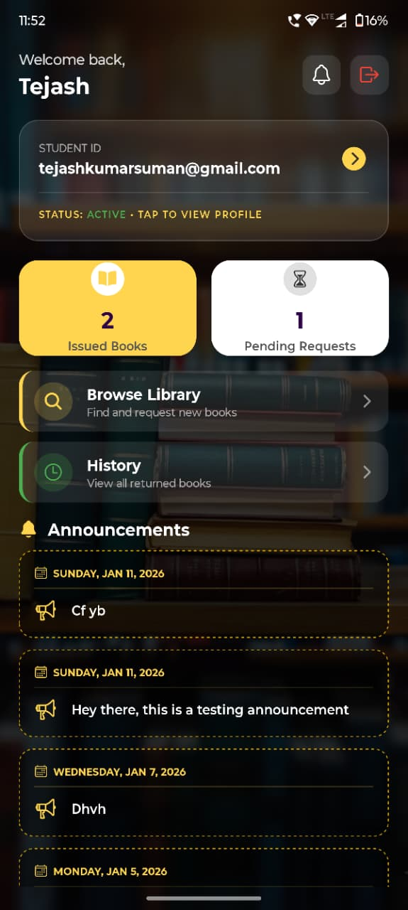
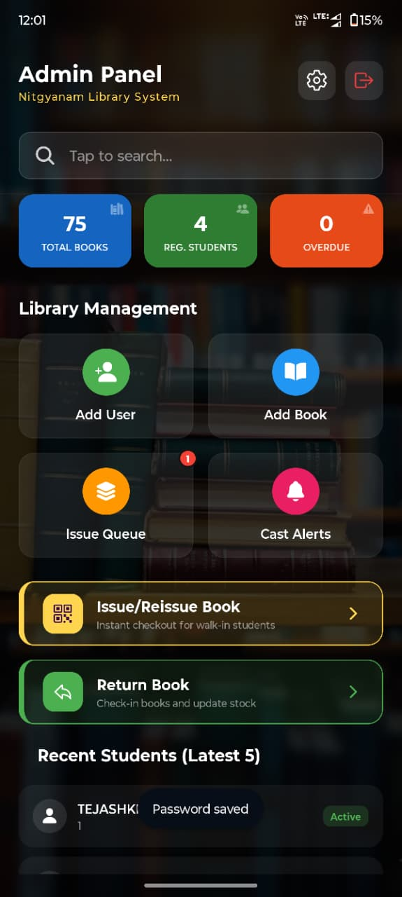
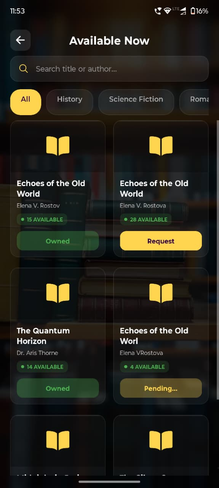
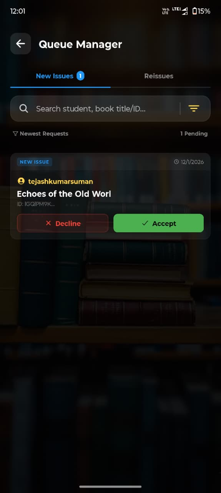
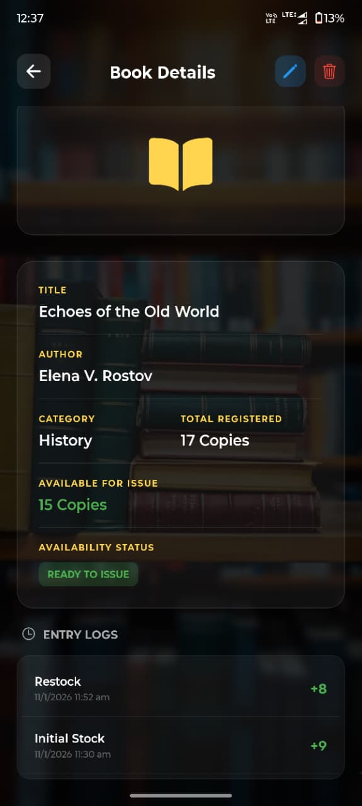
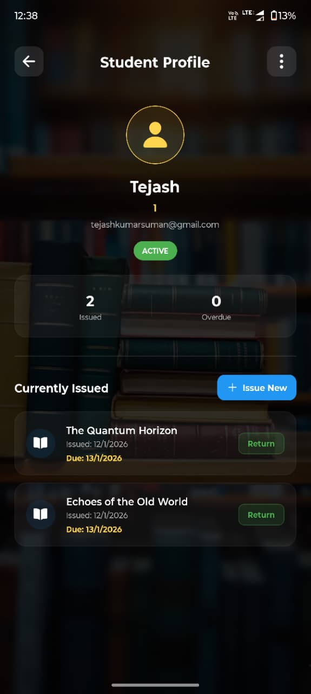

# 📚 VidyaGranth: Smart Library Management System

   

**VidyaGranth** is a modern, cross-platform mobile application designed to digitize and streamline library operations. Built during a **1-week rapid development sprint**, it bridges the gap between students and librarians by offering real-time book tracking, digital issue requests, and instant broadcast alerts.

---

## 📱 App Screenshots

| **Student Dashboard** | **Admin Panel** | **Book Discovery** |
|:---:|:---:|:---:|
|  |  |  |
| *Real-time status & alerts* | *Stats & Quick Actions* | *Category filtering & Live Stock* |

| **Queue Manager** | **Smart Notifications** | **Digital Book Profile** | **Digital Student Profile** |
|:---:|:---:|:---:|
|  |  |  |  |
| *Accept/Decline Requests* | *Instant Issue Confirmation* | *Digital ID Card* |

---

## ✨ Key Features

### 🎓 For Students
* **Live Dashboard:** View active loans ("Issued Books") and pending requests at a glance.
* **Smart Discovery:** Browse books by category (Sci-Fi, History) and see **real-time stock availability** (e.g., "15/17 In").
* **One-Tap Request:** Request books remotely. The button updates to "Pending..." instantly preventing duplicate requests.
* **Reading History:** A complete log of all returned books with dates.
* **Due Date Warnings:** Visual alerts for books expiring soon (e.g., "1 Days Left" tags).
* **Broadcast Notification:** A Broadcast meassaging by the admin for urgent updates to the students.

### 🛡️ For Admins (Librarians)
* **Queue Manager:** distinct tabs for **New Issues** and **Reissues**. Admins can "Accept" (Green) or "Decline" (Red) requests.
* **Broadcast System:** Post announcements (e.g., "New Arrivals") that instantly appear on all student dashboards.
* **Inventory Control:** Auto-decrement stock upon issue.
* **Student Management:** View a searchable list of all registered students and their "Active" status.
* **Dynamic Settings:** Change the "Default Borrow Duration" directly from the app settings.

---

## 🛠️ Technology Stack

* **Frontend:** React Native (Expo SDK 50)
* **Language:** JavaScript / TypeScript
* **Navigation:** React Navigation (Stack & Tabs)
* **Styling:** StyleSheet (Dark Mode implementation)
* **Icons:** Ionicons
* **Backend:** Google Firebase
    * **Authentication:** Email/Password Login
    * **Firestore:** Real-time NoSQL Database (Listeners for live updates)

---

## 🚀 Installation & Setup

To run this project locally:

1.  **Clone the repo**
    ```bash
    git clone [https://github.com/your-username/vidyagranth.git](https://github.com/your-username/vidyagranth.git)
    cd vidyagranth
    ```

2.  **Install Dependencies**
    ```bash
    npm install
    ```

3.  **Setup Firebase**
    * Create a project in Firebase Console.
    * Enable **Authentication** and **Firestore**.
    * Copy your `firebaseConfig` keys into `src/config/firebase.js`.

4.  **Run the App**
    ```bash
    npx expo start
    ```
    * Scan the QR code with the **Expo Go** app on your Android/iOS device.

---

## 📂 Project Structure
NitgyanamLibrary/ ├── app/ # Screens & Navigation (Expo Router) │ ├── admin/ # Admin routes (Dashboard, Queue, etc.) │ ├── student/ # Student routes (Home, Profile, etc.) │ └── auth/ # Login & Signup screens ├── assets/ # Images and Fonts ├── components/ # Reusable UI (Cards, Headers, Buttons) ├── constants/ # App Colors, Styles, Global Variables ├── hooks/ # Custom React Hooks ├── types/ # TypeScript Definitions ├── firebaseConfig.ts # Firebase Connection Logic └── README.md # Documentation

---

## 👨‍💻 Developer Info

Developed by **Tejash Kumar** as part of the **DSTTE Internship Program** (Jan 2026)  for the NITGyanam Consultancy Pvt. Ltd.

* **Contact:** spaciitks@gmail.com